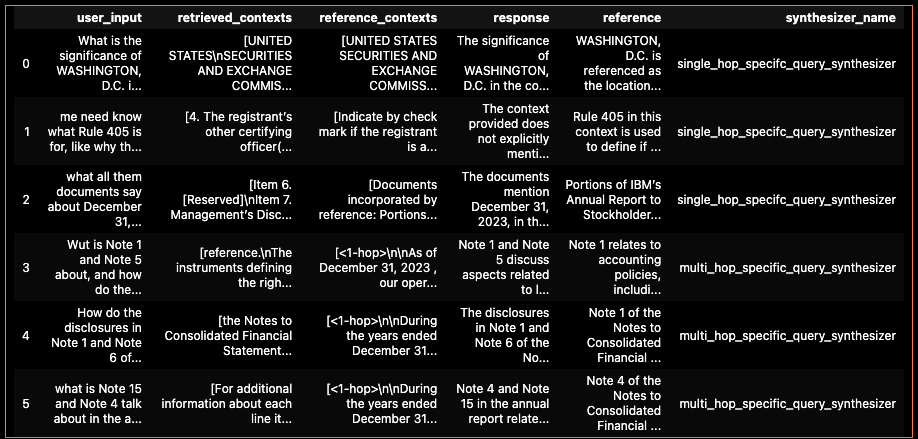

Certification Challenge - RAG for Effective Information Retrieval

Task 1 - 
Business Use Case

Problem Definitin :

 10-K reports from different industry players contain valuable financial information,risk factors, market trends and strategic initiatives. Extracting all this information from reports is manual and labor intensive. Going through the document to find the exact information needed takes a long time.

User Base: 
Many fintecs specialize in providing advanced analytics and insights for investment management and financial planning. The company handles an extensive collection of 10-K reports from various industry players, which contain detailed information about financial performance, risk factors, market trends, and strategic initiatives. Despite the richness of these documents, financial analysts struggle with extracting actionable insights efficiently in a short span due to the manual and labor-intensive nature of the analysis. Going through the document to find the exact information needed at the moment takes too long. This bottleneck hampers the company's ability to deliver timely and accurate recommendations to its clients.  

Task 2 -

Proposed Solution :

The objective is to develop an advanced RAG-based system to streamline the extraction and analysis of key information from 10-K reports.

The project will involve testing the RAG system on a current business problem. The Financial analysts are asked to research major cloud and AI platforms such as Amazon AWS, Google Cloud, Microsoft Azure, Meta AI, and IBM Watson to determine the most effective platform for this application. The primary goals include improving the efficiency of data extraction. Once the project is deployed, the system will be tested by a financial analyst with the following questions. Accurate text retrieval for these questions will imply the project's success.

Questions:
1.Has the company made any significant acquisitions in the AI space, and how are these acquisitions being integrated into the company's strategy?
2.How much capital has been allocated towards AI research and development?
3.What initiatives has the company implemented to address ethical concerns surrounding AI, such as fairness, accountability, and privacy?
4.How does the company plan to differentiate itself in the AI space relative to competitors?
5.Each Question must be asked for each of the five companies.
By successfully developing this project, we aim to:
Improve the productivity of financial analysts by providing a competent tool.
Provide timely insights to improve client recommendations.

Tools Used:

LLM - OpenAI
Embeding Model - text-embedding-3-small
Orchestration - Langchain
Vector Database - Qdrant
Monitoring -
Evaluation - RAGAS
User Interface - Chainlit

Task 3
Collect data for (at least) RAG and choose (at least) one external API

1. Data Sources  - Sec filed 10-k reports in PDF for Google, AWS , MSFT, META , IBM

2. External API - OpenAI API

3. Chunking Strategy - Chunk size= 500 , Chunk overlap = 20 . Allowing overlap of 20 to maintain context.

Task 4

End to End Prototype

Task 5 

Generate a synthetic test data set to baseline an initial evaluation with RAGAS

1. Table of output results

{'context_recall': 0.2778, 'faithfulness': 0.3958, 'factual_correctness': 0.3083, 'answer_relevancy': 0.6308, 'context_entity_recall': 0.1656, 'noise_sensitivity_relevant': 0.0370}

2. What conclusions can you draw about the performance and effectiveness of your pipeline with this information?

Looks like the performance of the RAG pipeline is not upto to expectation. There will be more changes to be done to the pipeline based on baseline

Task 6 

Generate synthetic fine-tuning data and complete fine-tuning of the open-source embedding model
